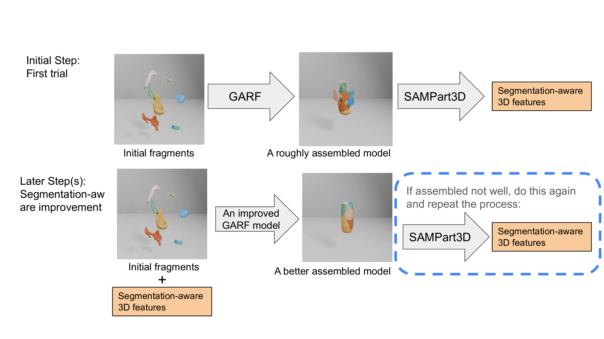

# LLVM-Assisted Reassembly: Improving 3D Reassembly for Real-World Fractures

This project explores methods to improve the **GARF** 3D reassembly framework using LLVM-assisted workflows, semantic segmentation, and realistic fracture data. It consists of two major contributions:

1. Participation in the original [GARF](https://github.com/ai4ce/GARF) project.
2. LLVM assisted extensions to GARF to improve performance on real-world fracture data.

---

## Overview

**GARF** is a generalizable flow-matching-based method for 3D fragment reassembly.
- Part 1 introduces my codes that contributes to the vanilla GARF project.
- Part 2, **as the major part of the repository**, showcases **my extended work** built upon GARF, with a focus on:
  - Integrating **3D segmentation-aware features** using SAMPart3D
  - Generating **high-fidelity fractured datasets** using physically-based simulations (FractureBEM)

---

## Part 1: Contributions to GARF

The source code of the original GARF project is available here:  
[https://github.com/ai4ce/GARF](https://github.com/ai4ce/GARF)

My contributions (not included in this repo for privacy and modularity) include:
- *Designing a visualization tool for animating the flow-matching transformation process*
- Data preprocessing and unification for mesh fragments
- Benchmark evaluation and dataset curation

These contribution have been discussed clearly in the report and can be viewed in the original GARF project. The visualization tool will be open-sourced soon. Please check out the original GARF repository.

---

## Part 2: LLVM-Based Improvements

### Direction 1: Recursive Pipeline with SAMPart3D

As demonstrated in the figure below, this method proposes a self-improving pipeline that combines:
- Initial step: Reassembly using the vanilla GARF model to obtain a roughly assembled structure, enabling the extraction of 3D segmentation-aware embeddings for each component.
- Later step(s): Feature augmentation using SAMPart3D's segmentation-aware embeddings, followed by reassembly with a new GARF-like model trained on the augmented feature space.
- Recursive refinement: Iteratively updating reassembly results based on newly extracted semantic feedback.

<!--  -->


#### Resources:
- GARF: I provide a breif implementation of GARF for my experiment `GARF/`. For the full implementation, please check the original GARF project [https://github.com/ai4ce/GARF](https://github.com/ai4ce/GARF)
- Folder: `SAMPart3D/` — contains implementation of the first two stages of [SAMPart3D](https://github.com/Pointcept/SAMPart3D) for my project.
- Testing data: `mydata/` — includes `.glb` model inputs. This is generated from BreakingBad dataset. 
- Please follow the guidelines under the folder to run example demonstration. The experiment results in my report can be replicated by using the models in `mydata/`.

#### Installation of GARF
[uv](https://docs.astral.sh/uv/) can be used to manage the dependencies. Follow the instructions [here](https://docs.astral.sh/uv/getting-started/installation/) to install uv. Then, simply run
```bash
uv sync
uv sync --extra post
source ./venv/bin/activate
```
to install the dependencies and activate the virtual environment. Please be noted that `flash-attn` requires CUDA 12.0 or above and `pytorch3d` may need GPU available when installing it, or it will compile with no GPU support.

#### Data Preparation
I used the Breaking Bad Volume Constrained dataset, post-processed by GARF, to run the experiment. [OneDrive](https://jdscript-my.sharepoint.com/:f:/g/personal/shared_jdscript_app/EqEvBJxkWcJOpLDqLTaYiQgBayhtJWEzwO7ftRUf6dMBMw?e=oREaca), [Google Drive](https://drive.google.com/file/d/1dBc7QRjOXIuYm-ssZo59vSlMD29xF5eM/view?usp=drive_link).

The conversion script supposes that Breaking Bad dataset is organized in the following structure:
```bash
├── breaking_bad
│   ├── artifact
│   ├── everyday
|       ├── BeerBottle
|       ├── ...
├── data_split
│   ├── artifact.train.txt
│   ├── artifact.val.txt
│   ├── everyday.train.txt
│   ├── everyday.val.txt
```
#### Evaluation using GARF
Go to the GARF folder:
```bash
cd GARF
```

Please use evaluation script in `scripts/eval.sh`, which looks like this:
```bash
EXPERIMENT_NAME="everyday_vol_one_step_init"
DATA_ROOT="../breaking_bad_vol.hdf5"
DATA_CATEGORIES="['everyday']"
CHECKPOINT_PATH="output/GARF.ckpt"

HYDRA_FULL_ERROR=1 python eval.py \
    seed=42 \
    experiment=denoiser_flow_matching \
    experiment_name=$EVAL_NAME \
    loggers=csv \
    loggers.csv.save_dir=logs/GARF \
    trainer.num_nodes=1 \
    trainer.devices=[0] \
    data.data_root=$DATA_ROOT \
    data.categories=$DATA_CATEGORIES \
    data.batch_size=64 \
    ckpt_path=$CHECKPOINT_PATH \
    ++data.random_anchor=false \
    ++model.inference_config.one_step_init=true
```

After running the script, the evaluation results will be stored in `logs/GARF/everyday_vol_one_step_init/`. In this folder, there's a `json_results` folder which contains the reassembly transformation results for all test samples. 

#### Visualization of GARF
I use my visualization tool to apply the transformation to the fragmented breaking bad models and obtained the reassembled model. However, this tools have not been open source. I have included some `.glb` model in `mydata` for evaluation. This `.glb` can be used in the SAMPart3D 3D segmentation-aware embedding extraction.

#### Training of GARF

The future work includes retraining a GARF-like pipeline using the features augmented with the 3D segmentation-aware features. This will be implemented after I manage to extract the 3D segmentation-aware features of high quality. Please check the technical report for a further explanation. 

#### 3D Segmentation-aware Features Extractopm using SAMPart3D

With the rougly assembled model, we can use SAMPart3D to extract 3D segmentation-aware embedding. Go to the SAMPart3D folder:
```bash
cd GARF
```

#### Installation of SAMPart3D
Please refer to [SAMPart3D/INSTALL.md](SAMPart3D/INSTALL.md).

#### Preparation for training SAMPart3D

1. Download pretrained PTv3-object [https://huggingface.co/yhyang-myron/SAMPart3D/tree/main](https://huggingface.co/yhyang-myron/SAMPart3D/tree/main).

2. Data prepocessing

    Blender 4.0.0 is required to render multi-view rgb and depth of the 3D glb mesh. First Install Blender:
    ```bash
    wget https://download.blender.org/release/Blender4.0/blender-4.0.0-linux-x64.tar.xz
    tar -xf blender-4.0.0-linux-x64.tar.xz
    rm blender-4.0.0-linux-x64.tar.xz
    ```
    Then render rgb and depth:
    ```bash
    cd tools
    ${PATH_TO_BLENDER} -b -P blender_render_16views.py ${MESH_PATH} ${TYPES} ${OUTPUT_PATH}
    ```   
    For example:
    ```bash
    blender-4.0.0-linux-x64/blender -b -P blender_render_16views.py mesh_root/knight.glb glb data_root/knight
    ```

#### Running SAMPart3D to Extract 3D Segmentation-aware Features
##### 1. Train
Change the rendering **data_root**, **mesh_root** and **backbone_weight_path** in `configs/sampart3d/sampart3d-trainmlp-render16views.py`. The corresponding `.glb` model in `mydata` need to be assigned in the following structure.
```bash
SAMPart3D
|-- ckpt
    |-- ptv3-object.pth
|-- mesh_root
    |-- hand.glb
|-- data_root
    |-- hand
        |-- meta.json
        |-- render_0000.webp
        |-- depth_0000.exr
        ...
```

```bash
export CUDA_VISIBLE_DEVICES=${CUDA_VISIBLE_DEVICES}
sh scripts/train.sh -g ${NUM_GPU} -d ${DATASET_NAME} -c ${CONFIG_NAME} -n ${EXP_NAME} -o ${OBJECT_UID}
```
For example:
```bash
sh scripts/train.sh -g 1 -d sampart3d -c sampart3d-trainmlp-render16views -n hand -o hand
```

The mesh segmentation results will be saved in `exp/${DATASET_NAME}/${EXP_NAME}/resuls`, and the visualization of point clouds and meshes under different scales will be saved in `exp/${DATASET_NAME}/${EXP_NAME}/vis_pcd/`.

#### Recursively Inference

In the future, a GARF-like model will be trained and is able to use these SAMPart3D features as inputs to generate better assembled models recursively.


---

### Direction 2: Physically-Based Dataset Generation

This direction improves reassembly training data using **realistic fracture surfaces** generated by:
- [FractureRB] `FractureRB-CX/` — deployed using Docker. It is modified from the original [fractureRB repository](https://github.com/david-hahn/FractureRB). Please follow the guidelines under the folder to run example demonstration.


#### My deployment

I deploy this project using Docker on Debian (debian::burst) while developing locally on macOS. 
```bash
cd FractureRB-CX 
```

#### How to Run the `glass.sh` Example1. build docker images
1. **Build the Docker Image**
```bash
docker build -t fracture-rb . 
```

2. **Enter the Docker Container**
```bash
docker run -it -v "$PWD":/app \
-w /app \
fracture-rb bash
```

3. **Build and Compile the Project**
```bash
mkdir -p build && cd build
cmake .. \
-DCMAKE_CXX_FLAGS="-D_GLIBCXX_USE_CXX11_ABI=1" \
-DCMAKE_BUILD_TYPE=Debug \
-DHLIB_INC=/usr/include/eigen3 \
-DBULLET_IMPORTER=/usr/local/lib/libBulletWorldImporter.so \
-DBULLET_LOADER=/usr/local/lib/libBulletFileLoader.so \
-DHYENA_LIB2=/app/hyena/libHyENAlib2.so \
-Dzlib=/usr/lib/x86_64-linux-gnu/libz.so \
-DHalflib=/usr/lib/x86_64-linux-gnu/libHalf.so \
-DOpenVDBlib=/usr/local/lib/libopenvdb.so \
-DOpenVDBinclude=/usr/local/include

make -j$(nproc)
```

4. **Run the Example**
```bash
cd ../examples
chmod +x glass.sh
./glass.sh
run
```

5. **MAYA is required to animate the process.** A short gif of the glass fracture example can be viewed below, from which you can observe the realistic fracture effect. If the gif failed to render, please check out `images/scene.gif`. 

<!--  -->


---

## Acknowledgements

This project builds upon the contributions of several open-source efforts. I gratefully acknowledge the following repositories:

- [GARF](https://github.com/ai4ce/GARF): A generalizable 3D reassembly framework based on flow matching.  
- [SAMPart3D](https://github.com/Pointcept/SAMPart3D): A semantic segmentation framework that distills 2D segmentation into 3D point clouds for part-aware understanding.  
- [FractureRB](https://github.com/david-hahn/FractureRB): A physically-based fracture simulation system for generating realistic fractured object datasets.

We thank the authors of these projects for making their work publicly available.
